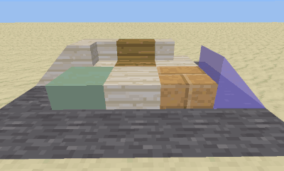

minetest mod Stairs
=========================

Featured stairs with transparent and glowing stairs, slopes, fuel feature, etc

Information
-----------

This mod is named `stairs` and its a featured replacement of default one;
this mod has been amended to add new features like transparent and glowing
stairs, slopes, recipes to return stairs / slopes back into blocks and also for
stairs to be used as fuel for furnaces, also alternative placement functions
that use on_rotate and sneak key.

Tech information
----------------

This mod sustitute default one, you must disable the default of minetest
game if present or override it.

#### Dependencies

* default

License
-------

### Authors of source code

Originally by Kahrl <kahrl@gmx.net> (LGPLv2.1+) and
celeron55, Perttu Ahola <celeron55@gmail.com> (LGPLv2.1+)
Various Minetest developers and contributors (LGPLv2.1+)
http://www.gnu.org/licenses/lgpl-2.1.html

### License of media (textures and sounds)

Attribution-ShareAlike 3.0 Unported (CC BY-SA 3.0)
http://creativecommons.org/licenses/by-sa/3.0/
